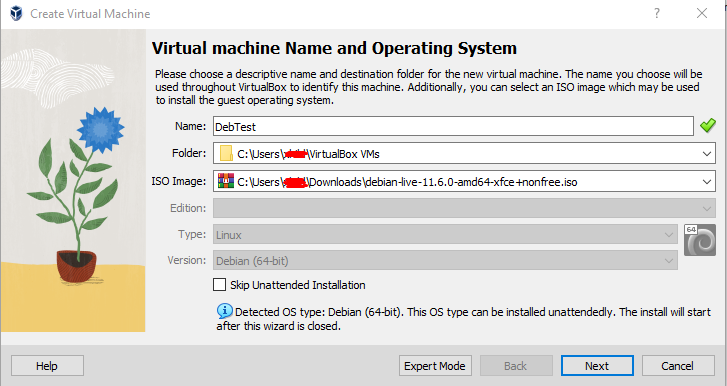
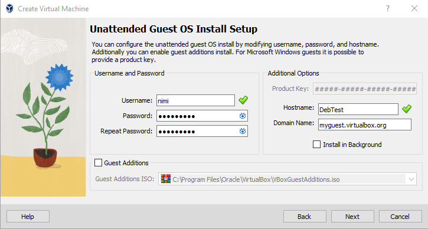
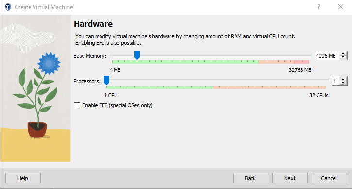
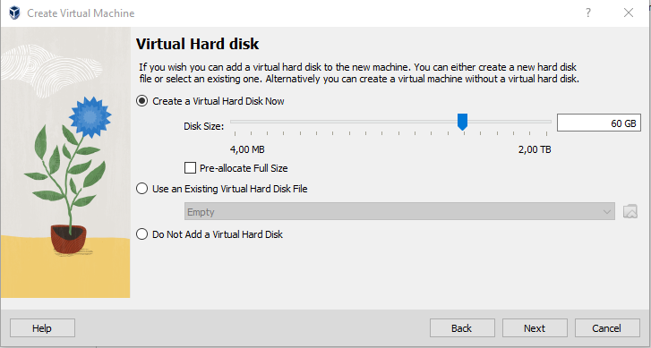
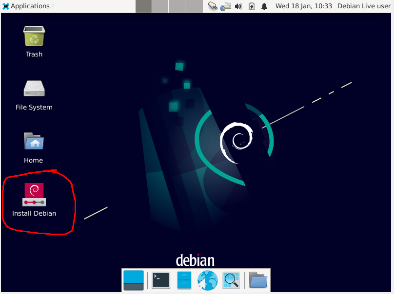
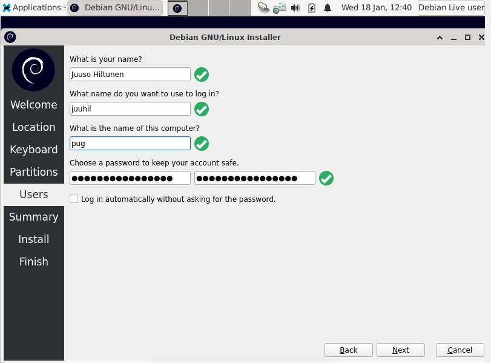
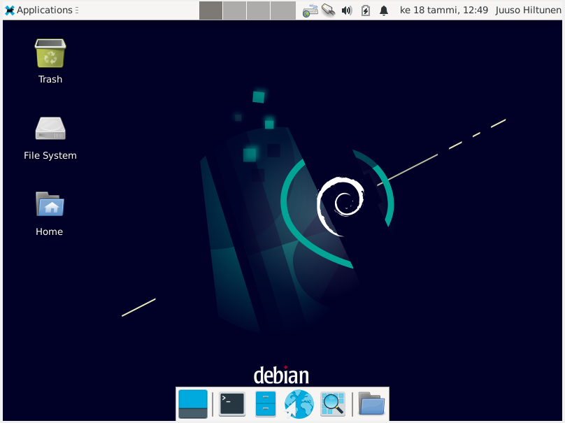

### Virtuaali Linux
Tein harjoituksen kotona työkoneellani 18.1.2023. 12.00-12.50

        Koneen rauta ja käyttöjärjestelmä
        Intel i7-13700K 5,4GHz
        Corsair Vengeance 32GB DDR5 5200Mhz
        Strix GeForce RTX 3080 OC 10G
        Windows 10 Pro, Versio 21H2
        
        Versiot. 
        VirtualBox -7.0.6-155176.
        debian-live -11.6.0
        

### 1. Lataa VirtualBox
https://www.virtualbox.org/wiki/Downloads > Windows hosts.

VirtualBoxin setupista valinnat, Next, Next, Yes, Yes, Install, Finish. 

### 2. Lataa Debian GNU/Linux.
https://cdimage.debian.org/images/unofficial/non-free/images-including-firmware/current-live/amd64/iso-hybrid/

Debianin sivulta 3. Alin vaihtoehto "debian-live-11.6.0-amd64-xfce+nonfree.iso".

### 3. VirtualBox käyttöön
Avasin VirtualBoxin ja painoin "New"

 

Nimesin Virtuaali koneen. Valitsin aiemmin ladatun Debian.iso tiedoston ISO IMAGE kohtaan.
"Next"

Vaihdoin "username" ja "password".
"Next"

 

Laitoin "Base Memory" kohtaan 4G=4096 MB RAM:ia.
"Next"

Laitoin "Disk Size" 60 GB
"Next"

Viimeiseen kohtaan painoin "Finish"

### 4. Debianin Asennus

VirtualBoxin pitäisi aukaista itsestään juuri luotu virtuaalikone. 
Jos virtuaalikone ei ole auki, valitse VirtualBox Managerista juuri luotu virtuaalikone ja "Start"

Valitsin työpöydältä "Install Debian" ja avasin sen.

- Welcome sivulta American English ja "Next".
- Location sivulta Helsinki ja "Next".
- Keyboard sivulta Finnish ja Default ja "Next".
- Partitions sivulta. Erase disk ja "Next".
- Users sivulle täytä tiedot. Computer Name kohtaan älä laita omaa nimeäsi tai mitään muuta josta sinua voitaisiin tunnistaa. "Next"  

- Summary, jos alapalkki katoaa, laita Debian Installer kokoruudulle ja "Install"
- Install kestää jonkin aikaan. 
- Finish sivulta "Restart now" ja "Done"

Virtuaalikone käynnistää itsensä uudelleen ja pyytää kirjautumaan sisään "Users" sivulla annetuiden tietojen avulla. 
Kirjautumisen jälkeen, pääsin työpyödälle 

### 5. Päivitykset
Käynnistin koneen uudelleen ja päätin päivittää kaiken
Avasin terminalin ja kirjoitin.
       
       $ sudo apt-get update
       
tässä välissä terminaali pyysi salasanaa.
        
        $ sudo apt-get -y dist-upgrade
        
Päivitin kaikki uusimpaan versioon

Asensin palomuurin ja laitoin sen päälle. 
        
        $ sudo apt-get -y install ufw
        $ sudo ufw enable
        
Terminal ilmoitti Firewall is active and enabled on system startup
