### Tiivistelmä
- Komentoja hakemistoissa liikkumiseen. 
- Tärkeitä hakemistoja.
- Admin komentoja.

https://terokarvinen.com/2020/command-line-basics-revisited/?fromSearch=command%20line%20basics%20revisited

## Rauta

    Koneen rauta ja käyttöjärjestelmä
    Intel i7-13700K 5,4GHz
    Corsair Vengeance 32GB DDR5 5200Mhz
    Strix GeForce RTX 3080 OC 10G
    Windows 10 Pro, Versio 21H2
    
    Versiot. 
    VirtualBox -7.0.6-155176.
    debian-live -11.6.0

## Tehtävät 

### Micro-editor
10:35-10:40 Avasin terminalin 

      sudo apt-get install micro
      
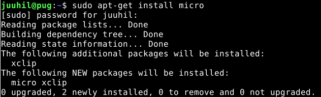

### Koneen rauta
10:40-10:45. Asensin lshw:n komennolla

    sudo apt-get install lswh

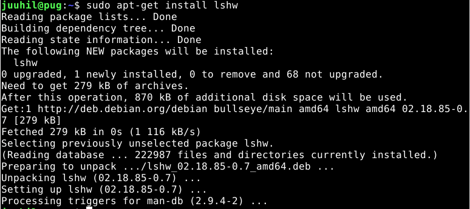

    
    sudo lshw -short -sanitize
    
komento listaa virtuaalikoneen käyttössä olevat komponentit, annoin virtuaalikoneelle käyttöön  4GB muistia ja sekin näkyy 

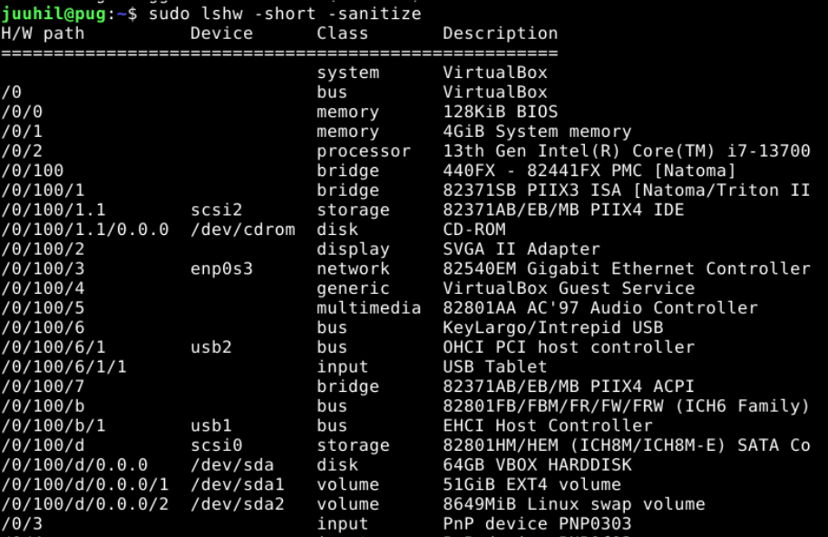

### Apt. Asenna kolme itsellesi uutta komentoriviohjelmaa. 
11:00-11:20
#### Cowsay 
Asensin cowsay:n komennolla

      sudo apt-get install cowsay
      
      
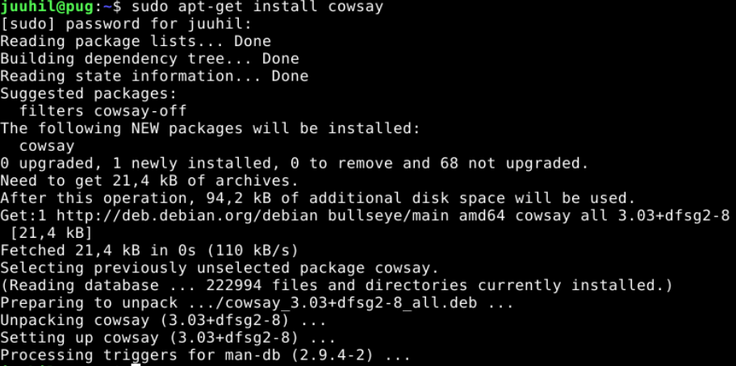
cowsay
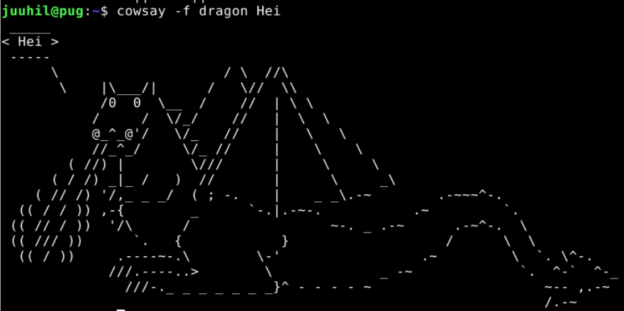

#### Tree hakemistopuu
Asensin tree ohjelman komennolla

     
      sudo apt-get install tree
      
      
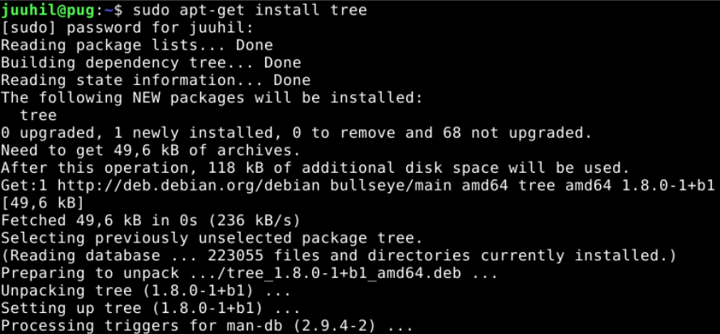
tree tekee yksinkertaisen hakemistopuun
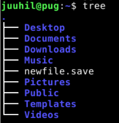

#### Nano text editor
Asensin nano ohjelman komennolla

      sudo apt-get install nano
      
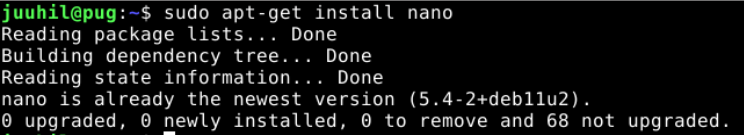
Nano on yksinkertainen tekstieditori
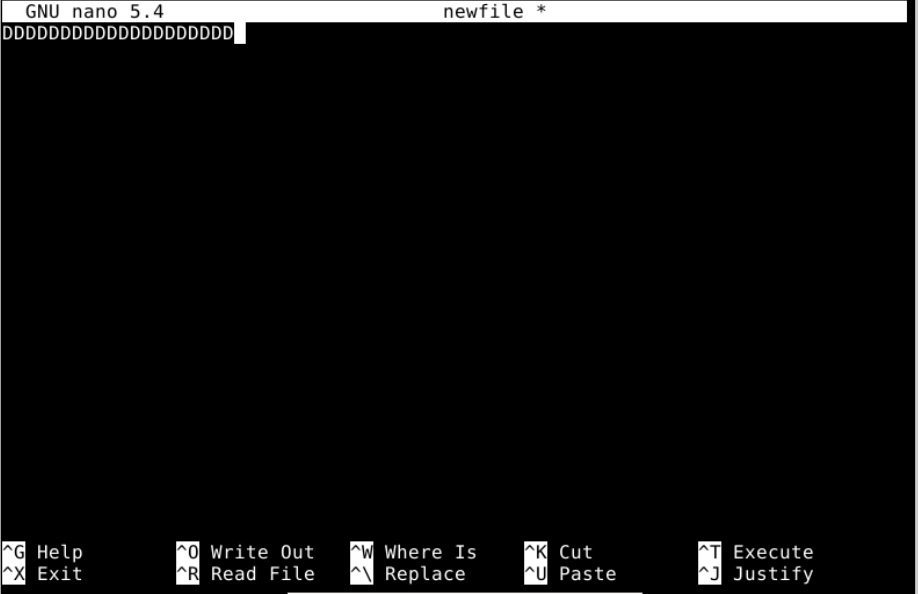

### FHS. Esittele "Important directories" kansiot.
11.45-12.00

            ls /
            
Juurihakemisto, tiedostojärjestelmän yläosa.
            
            ls /home/
            
Kotihakemistot kaikille käyttäjille.
            
            ls /home/juuhil/

Käyttäjän "juuhil" kotihakemisto.           
            
            ls /etc/
           
Järjestelmän laajuiset asetukset.

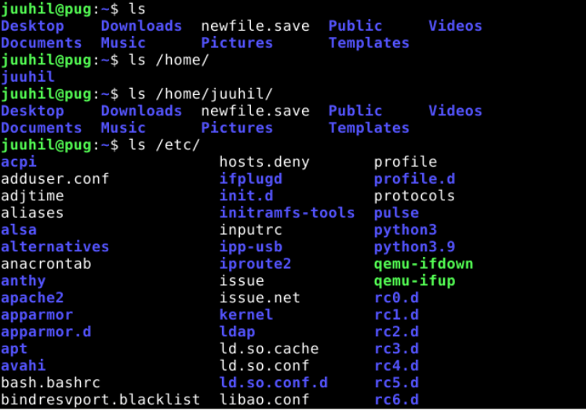

            ls /media/

Irotettavat mediat. Esim usbtikku

            ls /var/log/
            
Järjestelmänlaajuiset lokit.
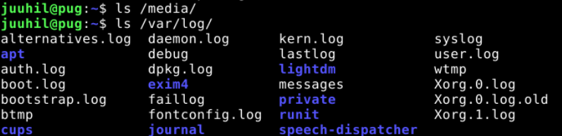

### Grep komento.
12.00-12.30
Grep komennolla voi etsiä erilaisia merkkijonoja.
Esimerkki 1. 

Haen "hostnamectl" tiedostosta sanaa "kernel". -i ennen kernel:iä etsii isolla tai pienellä kirjoitettua. 

Esimerkki 2.

Etsin linus.txt tiedostosta sanoja missä on t kirjain. Niitä löytyi 5.

